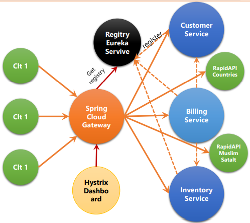

# HPC_distributed-system_micro-services

### Application 
- Créer une application basée sur deux services métiers:
  - Service des clients 
  - Service d’inventaire
  - Service Facturation
  - Services Externes : RapidAPI 
- L’orchestration des services se fait via les services
  - techniques de Spring Cloud :
      - Spring Cloud Gateway Service comme service proxy
      - Registry Eureka Service comme annuaire d’enregistrement et de découverte des services de  l’architecture
      - Hystrix Circuit Breaker
      - Hystrix Dashboard

