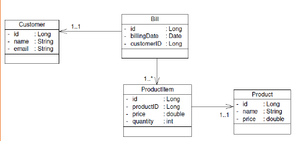
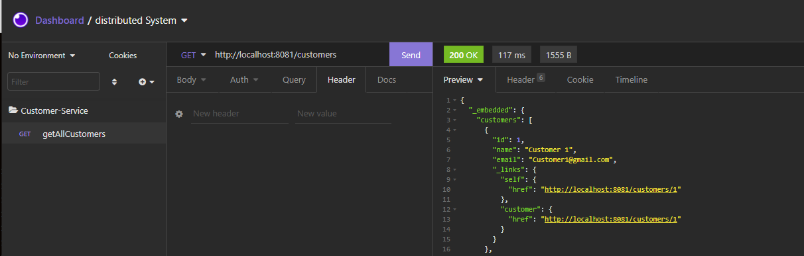
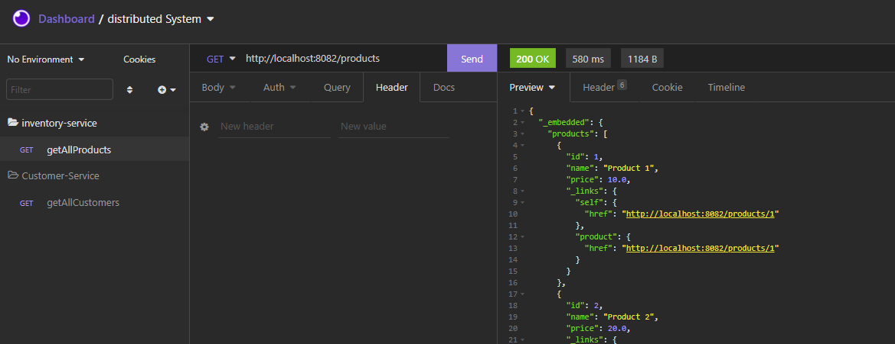
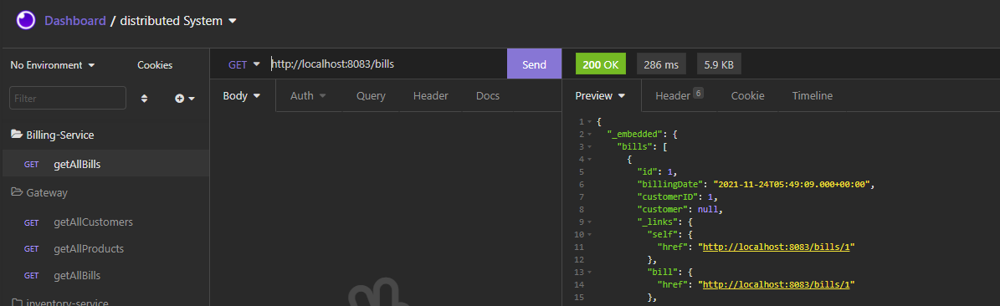
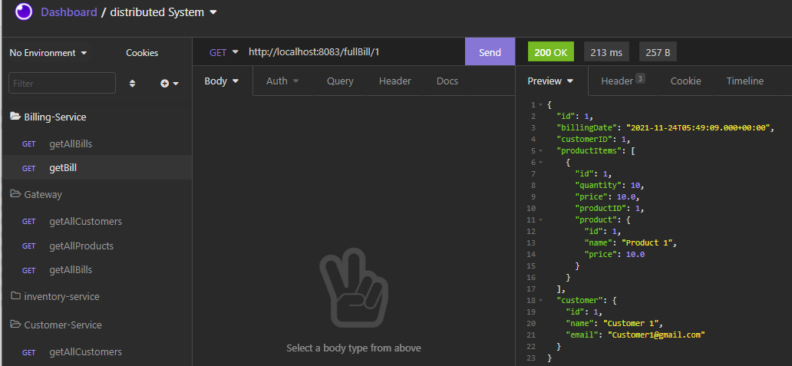
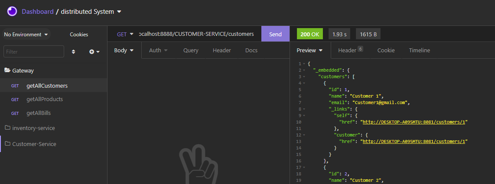
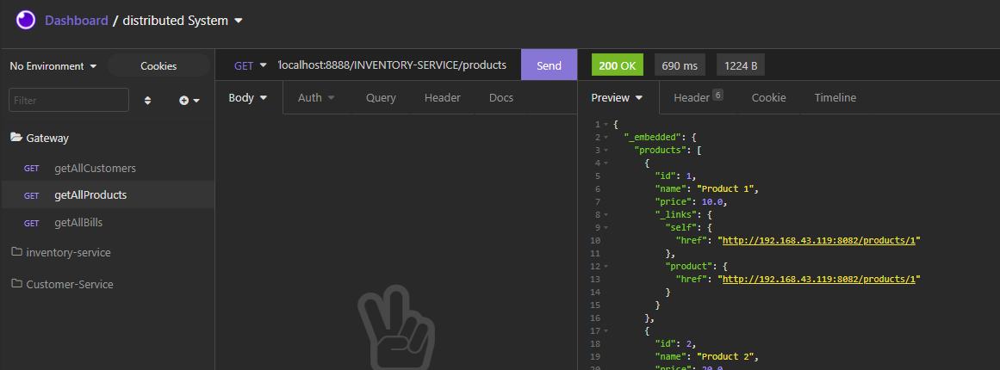
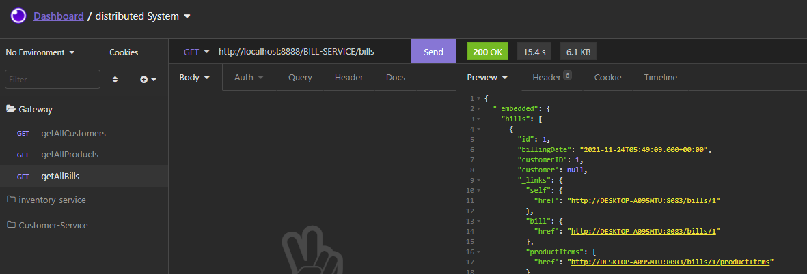
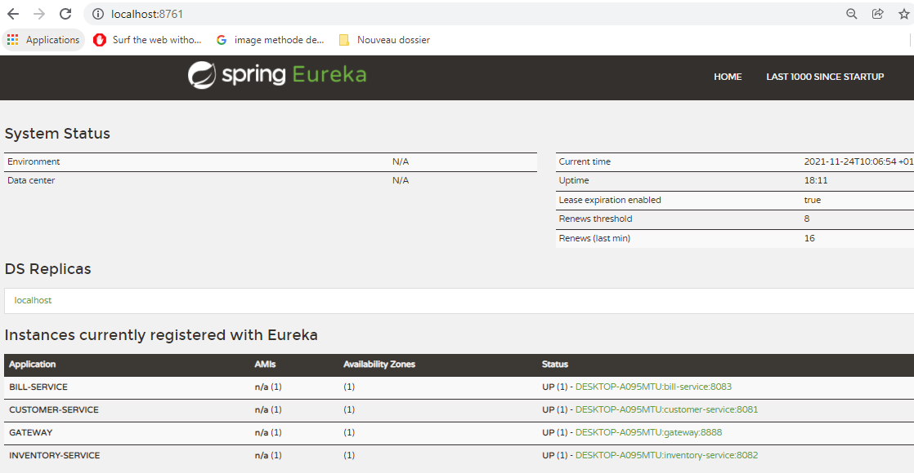
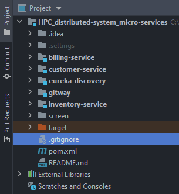

# HPC_distributed-system_micro-services

## Application
- Créer une application basée sur deux services métiers:
    - Service des clients
    - Service d’inventaire
    - Service Facturation
    - Services Externes : RapidAPI
- L’orchestration des services se fait via les services
    - techniques de Spring Cloud :
        - Spring Cloud Gateway Service comme service proxy
        - Registry Eureka Service comme annuaire d’enregistrement et de découverte des services de  l’architecture
        - Hystrix Circuit Breaker
        - Hystrix Dashboard
## Architecture du projet
 

## Diagramme de classe
 

## Technologie est Tools
- IntelliJ IDEA
- Java 8
- Maven
- Spring Boot
- Spring(IOC, Data ,Hibernate,MVC, Cloud)
- Spring Boot DevTools
- Mysql database
- lombok

## 1) Customer-Service
Customer-Service est le microservice qui fait la gestion des Clients (Customers)
### Test
 

## 2) Inventory-service
Customer-Service est le microservice qui fait la gestion des produits

### Test
 

## 3) billing-Service
bill-Service est le microservice qui fait la gestion des facture , il communique avec les services Customer service et Inventory service  avec Open Feign (Communication REST)
###  Test
- GetAllBills
  

- Get Bill Avec tout les details (customer ,products Items, products)
  

## 4) Gateway
Créer la Gateway service en utilisant Spring Cloud Gateway
### Configuration
Configuration dynamique
- Accès au microservcies
    - http://localhost:8888/CUSTOMER-SERVICE/customers
    - http://localhost:8888/INVENTORY-SERVICE/products
    - http://localhost:8888/BILL-SERVICE/bills
### Test
- Microservcie customer-service
  

- Microservcie Inventory-service
  

- Microservcie bill-service
  

## 5) eureka-discovery
L’annuaire Registry Service basé sur NetFlix Eureka Server
### Test
 

## 6) Use
Ce projet est un projet Maven qui contient cinq module(Microservcies) (customer-service , inventory-service , gateway,billing-service , gateway-service, eureka-server)
- git clone repo
- configuration Databsae pour chaque microservice (application.properties)
- Run chaque microservice

 

## 7) Sources
pour plus de détails consulter les sources suivantes
- demo video  [Distributed HPC - Micro Services - Spring Gloud Gateway and Eureka Registry Implementation ](https://youtu.be/IhNxrE5tlXs)
- Spring doc  [Spring cloud  doc](https://spring.io/projects/spring-cloud)
### Enjoy !!
 

